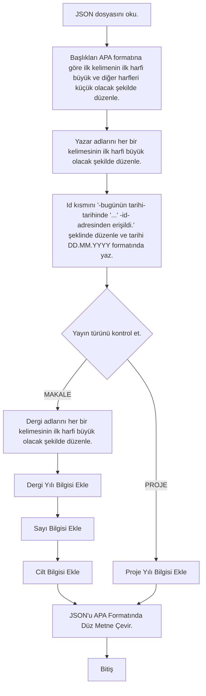

# Apa Oluşturucu
JSON formatında verilen üst verileri APA kaynak gösterme stilinde yazan bir araç 

## Algoritma

```mermaid
flowchart TD
    F1["JSON dosyasını oku."] --> F2["Başlıkları APA formatına göre ilk kelimenin ilk harfi büyük ve diğer harfleri küçük olacak şekilde düzenle."]
    F2 --> F3["Yazar adlarını her bir kelimesinin ilk harfi büyük olacak şekilde düzenle."]
    F3 --> F4@{ label: "Id kısmını '-bugünün tarihi- tarihinde '...' -id- adresinden erişildi.' şeklinde düzenle ve tarihi DD.MM.YYYY formatında yaz." }
    F4 --> F5{"Yayın türünü kontrol et."}
    F5 -- MAKALE --> F6["Dergi adlarını her bir kelimesinin ilk harfi büyük olacak şekilde düzenle."]
    F6 --> F10["Dergi Yılı Bilgisi Ekle"]
    F10 --> F7["Sayı Bilgisi Ekle"]
    F7 --> F11["Cilt Bilgisi Ekle"]
    F11 --> F8@{ label: "JSON'u APA Formatında Düz Metne Çevir." }
    F5 -- PROJE --> F12["Proje Yılı Bilgisi Ekle"]
    F12 --> F8
    F8 --> F9["Bitiş"]
    F4@{ shape: rect}
    F8@{ shape: rect}

```
